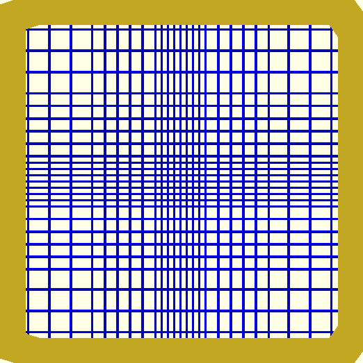
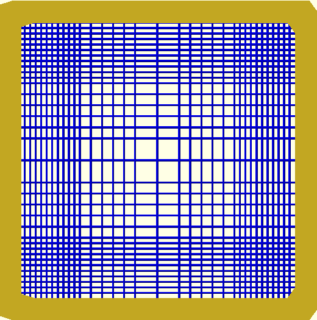
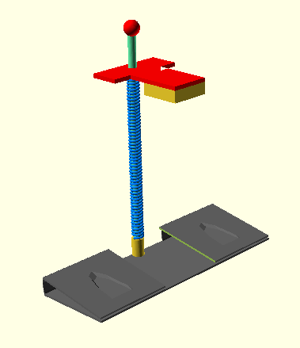
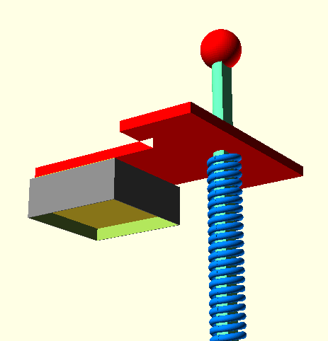

# OpenSCAD_Cutter_Model
An original design for a die cutter built to cut polymer networks off solid frames.

## Examples of experiment samples
The images below shows examples of polymer network samples that needs to be cut off the scaffold farmes.

Dense middle, sparse edges | Sparse middle, dense edges
:-------------------------:|:-------------------------:
 | 
Inhomogeneous network that is denser in the middle and sparser in the edges | Inhomogeneous network that is spacious in the middle and denser in the edges

## Problem and Design

The cutting holds 2 problems: 
- first, sometimes the razor does not cut the fibers well enough, leaving one/two fiber attached to the frame (usually near the corners). When lifting the frame, the network hangs from the remaining fibers and entangles, which render it unusable.
- Second, the small size of the frame and the slippery icy surface make it though to cut all four sides of the network off the frame without the frame moving and potentially mess up the network.

To solve both problems, I designed a small and simple device that supposed to cut all four sides in one shot. The tip is replaceable to allow changing razors at will.

Zoom out on full cutter | Zoom in on cutter's top
:-------------------------:|:-------------------------:
  |  
The base (dyed black) is composed of two metal clips to hold the slide. A spring coil (dyed blue) is threaded on a D shape pole (dyed turquoise) holding a rectangular stripe (dyed red) which itself holds the cutting tip (yellow) onto which the razors are glued. | The red stripe is pierced with a D shape hole to prevent it from rotating. On top of the pole the red sphere prevent both the stripe and the spring from getting off the pole (ideally it screws onto the top to enable replacement in case of need). The tip is made of a disposable cheap material (e.g. a teflon cube) and the knives (dyed gray) are as sharp as possible.
